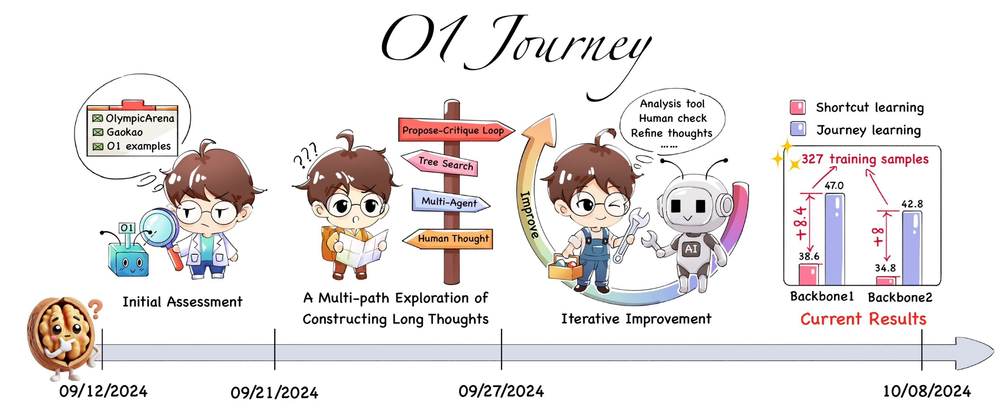

# O1 Replication Journey



## About the Team

The core development team of this project mainly consists of third- and fourth-year undergraduate students, as well as first-year PhD students from the GAIR research group at Shanghai Jiao Tong University. The project has been guided by leading research scientists in the field of large language models, including those from NYU and MBZUAI.

The specific introductions of the team members are as follows:

<!-- |   |   |   |   |   |   |
|---------|---------|---------|---------|---------|---------|
|||||||
|[Yiwei Qin](https://qinyiwei.github.io)|[Xuefeng Li](https://scholar.google.com/citations?user=DDRBbxgAAAAJ&hl=zh-CN)|[Haoyang Zou](https://scholar.google.com/citations?user=btPmUcoAAAAJ&hl=en)|[Yixiu Liu](https://scholar.google.com/citations?user=HKUoOq0AAAAJ&hl=zh-CN)|[Shijie Xia](https://shijie-xia.github.io)|[Zhen Huang](https://huangzhen02.github.io)|
|||||||
|[Yixin Ye](https://github.com/BLeaves)|[Weizhe Yuan](https://yyy-apple.github.io/)|[Zhengzhong Liu](https://hunterhector.github.io)|[Yuanzhi Li](https://scholar.google.com/citations?hl=en&user=aHtfItQAAAAJ&view_op=list_works&sortby=pubdate)|[Pengfei Liu](https://plms.ai/)|| -->


[Yiwei Qin](https://qinyiwei.github.io), [Xuefeng Li](https://scholar.google.com/citations?user=DDRBbxgAAAAJ&hl=zh-CN), [Haoyang Zou](https://scholar.google.com/citations?user=btPmUcoAAAAJ&hl=en), [Yixiu Liu](https://scholar.google.com/citations?user=HKUoOq0AAAAJ&hl=zh-CN), [Shijie Xia](https://shijie-xia.github.io), [Zhen Huang](https://huangzhen02.github.io), [Yixin Ye](https://github.com/BLeaves), [Yuxiang Zheng](https://github.com/Zeetc), [Weizhe Yuan](https://yyy-apple.github.io/), [Zhengzhong Liu](https://hunterhector.github.io), [Yuanzhi Li](https://scholar.google.com/citations?hl=en&user=aHtfItQAAAAJ&view_op=list_works&sortby=pubdate), [Pengfei Liu](https://plms.ai/)


## Updates

- [2024/11/22] 🚨 We have published a new part of our study on O1-distillation, accompanied by in-depth reflections on the underlying behaviors and phenomena. Check our [report](./resource/report-part2.pdf)!
- [2024/10/16] We have released the journey thought training dataset on 🤗 [Hugging Face](https://huggingface.co/datasets/GAIR/o1-journey).
- [2024/10/09] 🚨 We have officially released [**the first** Strategic Report on O1 Replication](https://arxiv.org/pdf/2410.18982). We introduce a new training paradigm called ‘journey learning’ and propose **the first** model that successfully integrates search and learning in mathematical reasoning. The search process incorporates trial-and-error, correction, backtracking, and reflection, making this **the first** effective approach for complex reasoning tasks. If you do find our resources helpful, please [cite our paper](#citation).


## Our Journey 🗺️

### [Part2: Surpassing O1-preview through Simple Distillation (Big Progress or Bitter Lesson?)](./docs/part2.md)
[**Report (Part2)**](./resource/report-part2.pdf) | [**Citation**](#citation)


This paper critically examines current methods for replicating OpenAI’s O1 model, focusing on the often-overlooked use of knowledge distillation. While Part 1 explored foundational techniques for O1 replication, this study demonstrates how simple distillation from O1’s API, combined with supervised fine-tuning, can achieve superior performance on complex mathematical reasoning tasks.

Key findings include:

- Superior Performance with Simplicity: A base model fine-tuned on tens of thousands of O1-distilled chains outperformed O1-preview on the AIME with minimal technical complexity.
- Generalization Across Tasks: Despite being trained only on mathematical data, the distilled models showed strong performance in open-domain QA, reduced hallucination, and improved safety, while becoming less susceptible to sycophancy.
- Transparency and Education: The paper emphasizes the need for transparent research practices and prioritizing first-principles thinking over quick performance gains.


### [Part1: A Strategic Progress Report](./docs/part1.md)
[**Report (Part1)**](https://arxiv.org/pdf/2410.18982) | [**Dataset**](https://huggingface.co/datasets/GAIR/o1-journey) | [**Walnut Plan**](https://gair-nlp.github.io/walnut-plan/) | [**Citation**](#citation)


This paper introduces a pioneering approach to artificial intelligence research, embodied in our O1 Replication Journey. In response to the announcement of OpenAI’s groundbreaking O1 model, we embark on a **transparent**, **real-time exploration** to replicate its capabilities while reimagining the process of conducting and communicating AI research. 

We propose a new approach: “journey learning”. This paradigm goes beyond the traditional focus on specific tasks and emphasizes continuous progress through learning, reflection, and adaptation. AI systems that follow this method can evolve over time, improving their ability to handle real-world complexities. Unlike shortcut learning, journey learning equips AI with the capacity to adapt, backtrack, and refine its understanding, aiming to create more human-like intelligence. This shift to journey learning opens up new possibilities in AI research, enabling the creation of systems that can not only perform tasks but also reason and grow, making them more capable of engaging with humans across various domains.


## Progress

* We are gradually releasing resources, and more will be available soon. Stay tuned as we continue to share new updates over time!


## Contact Us

If you are interested in our project and would like to join us, feel free to send an email to [stefanpengfei@gmail.com](mailto:stefanpengfei@gmail.com).

## Citation


### Part1:

```
@article{o1journey,
  author = {Yiwei Qin and Xuefeng Li and Haoyang Zou and Yixiu Liu and Shijie Xia and Zhen Huang and Yixin Ye and Weizhe Yuan and Zhengzhong Liu and Yuanzhi Li and Pengfei Liu},
  title = {O1 Replication Journey: A Strategic Progress Report – Part 1},
  year = {2024},
  journal={arXiv preprint arXiv:2410.18982},
  url={https://arxiv.org/abs/2410.18982}
}
```

### Part2:

```
@article{o1journeypart2,
  author = {Zhen Huang and Haoyang Zou and Xuefeng Li and Yixiu Liu and Yuxiang Zheng and Ethan Chern and Shijie Xia and Yiwei Qin and Weizhe Yuan and Pengfei Liu},
  title = {O1 Replication Journey – Part 2: Surpassing O1-preview through Simple Distillation},
  year = {2024},
  journal = {Github},
  url = {https://github.com/GAIR-NLP/O1-Journey}
}
```