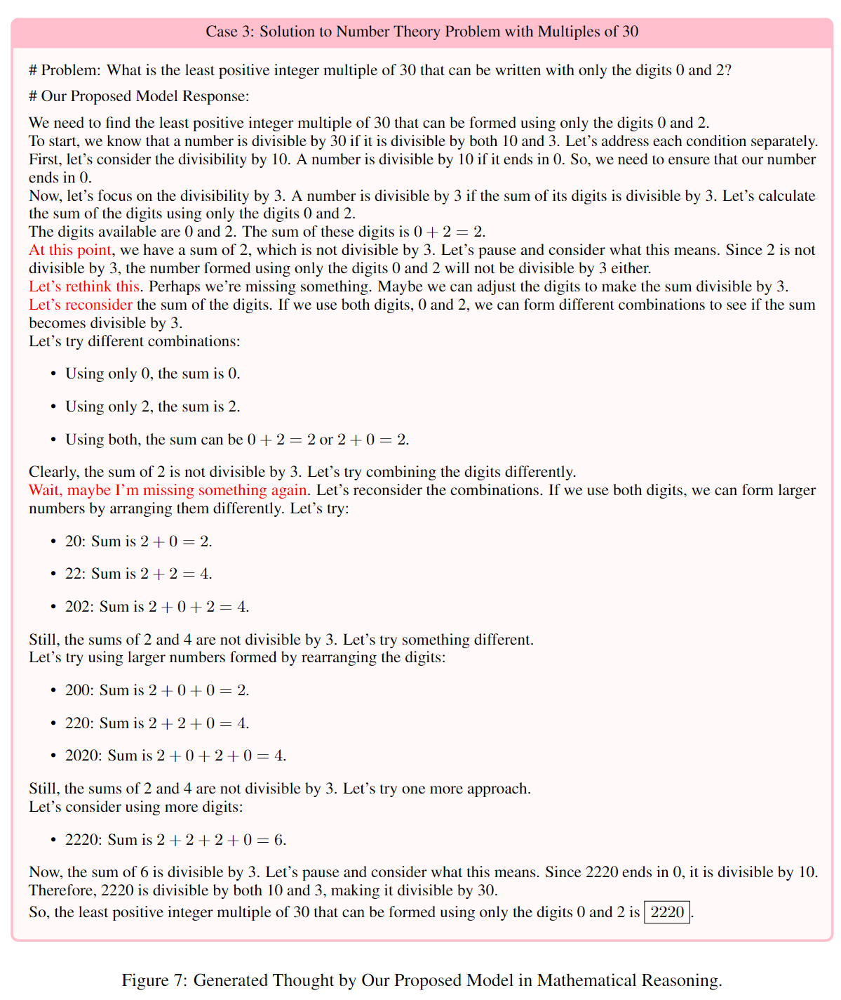

# O1 Replication Journey: A Strategic Progress Report


[Yiwei Qin](https://qinyiwei.github.io)\*, [Xuefeng Li](https://github.com/hongtangshui)\*, [Haoyang Zou](https://github.com/haoy-zzz)\*, [Yixiu Liu](https://github.com/yxliu0903)\*, [Shijie Xia](https://shijie-xia.github.io/)\*, [Zhen Huang](https://huangzhen02.github.io), [Yixin Ye](https://github.com/BLeaves), [Weizhe Yuan](https://yyy-apple.github.io/), [Hector Liu](https://hunterhector.github.io), [Yuanzhi Li](https://mbzuai.ac.ae/study/faculty/yuanzhi-li/), [Pengfei Liu](https://plms.ai/)+

* "*" Core contributors
* "+" Corresponding Author

Shanghai Jiao Tong University, New York University, MBZUAI, Generative AI Research Lab (GAIR)

We are gradually releasing resources, and more will be available soon. Stay tuned as we continue to share new updates over time!

## Contents

- [Introduction](#introduction)
- [About Progress Report](#about-progress-report)
- [Journey Learning](#journey-learning)
- [Exploration Journey](#exploration-journey)
    - [What does O1’s Thought Look Like?](#what-does-o1s-thought-look-like)
    - [How does Long Thought Work?](#how-does-long-thought-work)
    - [How to Construct Long Thoughts?](#how-to-construct-long-thoughts)
    - [How to Construct Reward Model?](#how-to-construct-reward-model)
    - [How to Construct an On-policy Reasoning Tree?](#how-to-construct-an-on-policy-reasoning-tree)
    - [How to Derive a Long Thought from a Reasoning Tree?](#how-to-derive-a-long-thought-from-a-reasoning-tree)
    - [How to Evaluate our Trials?](#how-to-evaluate-our-trials)
    - [How to Train our Models?](#how-to-train-our-models)
    - [What would be an effective annotation strategy for human-ai collaboration?](#what-would-be-an-effective-annotation-strategy-for-human-ai-collaboration)
- [Some Real Examples](#some-real-examples)
- [Released Resources](#released-resources)
- [About the Team](#about-the-team)
- [Contact us](#contact-us)
- [Citation](#citation)


## Introduction

This paper introduces a pioneering approach to artificial intelligence research, embodied in our O1 Replication Journey. In response to the announcement of OpenAI’s groundbreaking O1 model, we embark on a **transparent**, **real-time exploration** to eplicate its capabilities while reimagining the process of conducting and communicating AI research. 

## About Progress Report


Modern AI research often involves prolonged, collaborative efforts that extend far beyond the traditional scope of individual, short-term projects. These endeavors frequently require large teams, extensive computational resources, and iterative experimentation over the course of months or even years. As a result, the traditional approach of publishing findings only at the end of the research cycle is no longer sufficient to meet the demands of the field. Therefore, we represents a pioneering effort to reimagine the process of conducting and communicating AI research. By providing a comprehensive, real-time account of our journey to replicate the groundbreaking O1 model.


## Journey Learning

<p align="center">        </p>

Many current machine learning and large language model approaches can be described as “shortcut learning.” This method focuses on achieving quick results by heavily relying on large amounts of data to improve performance. However, it often struggles with generalization, meaning it performs poorly in situations outside its training data, and lacks the ability to self-correct mistakes. While it has driven advancements, shortcut learning shows limitations in handling complex, dynamic, and open-ended challenges, making it less effective for developing truly intelligent AI.

To address these limitations, we propose a new approach: “journey learning.” This paradigm goes beyond the traditional focus on specific tasks and emphasizes continuous progress through learning, reflection, and adaptation. AI systems that follow this method can evolve over time, improving their ability to handle real-world complexities. Unlike shortcut learning, journey learning equips AI with the capacity to adapt, backtrack, and refine its understanding, aiming to create more human-like intelligence. This shift to journey learning opens up new possibilities in AI research, enabling the creation of systems that can not only perform tasks but also reason and grow, making them more capable of engaging with humans across various domains.


## Exploration Journey

<p align="center">        </p>

We explore several questions which highlight a critical aspect of O1’s cognitive processes. We start by examining the structure of O1’s thoughts and progress to more advanced concepts, such as the development of reward models, on-policy reasoning trees, and how these elements come together in constructing long thoughts. Our methodology, as depicted in our research timeline, emphasizes iterative evaluation and training strategies, combining both quantitative assessments and human feedback.

### What does O1’s Thought Look Like?


<p align="center">        </p>

Our analysis focuses on O1’s reasoning examples provided by OpenAI, which includes eight instances of problem-solving steps for complex tasks. We categorized these examples by problem type and difficulty, observing that as problem difficulty increases, so does the length of the model’s responses in both tokens and lines. This trend suggests that more challenging problems require more reasoning steps.


Beyond just response length, we analyzed keyword frequencies. Words like “consider,” “if,” and “possible” frequently appear in more complex problems, indicating the model is exploring multiple solution paths. Keywords such as “wait” and “alternatively” signal the model’s ability to reflect and self-correct, suggesting a deeper, non-linear reasoning process.


<p align="center">        </p>

Additionally, we manually reviewed O1’s approach to solving mathematical problems, revealing a methodical thought process. The model uses iterative problem-solving techniques, breaking down complex equations, and frequently reassessing its steps for consistency. It also tests multiple hypotheses and concludes by verifying its final solution, ensuring accuracy and reliability in its reasoning.

### How does Long Thought Work?

While we are still in the hypothesis stage without sufficient empirical evidence, we believe the success of O1’s long-thought approach is due to journey learning, as discussed earlier. Unlike shortcut learning, journey learning allows the model to explore the entire decision-making process, much like human problem-solving. O1 can consider multiple solution paths, learn from mistakes, and develop a deeper understanding of the problem—not just finding the correct answer but understanding why and how to reach it.

By navigating both correct and incorrect paths, O1 improves its error-handling and adaptability to new challenges. This trial-and-error process, combined with reflection and adjustment, mirrors human cognitive processes and enhances the model’s explainability. O1 can not only provide the correct solution but also explain the reasoning behind it, including how it recovers from errors. This thorough exploration is why O1 excels at handling complex problems and offering reliable, interpretable answers across a range of tasks.

### How to Construct Long Thoughts?

Constructing long thoughts with actions such as reflection and backtracking is a key element of journey learning. We have explored several approaches to achieve this.

- **Attempt1: Tree Search with LLM and Reward:** In this method, reasoning is modeled as a search on a tree, where the problem is the root, and each node represents a reasoning step. When incorrect paths are identified, the model backtracks to find the correct solution. A fine-grained reward model guides this process, incorporating errors into the reasoning chain.
- **Attempt2: Propose-Critique Loop:** Attempt 1 constructs long thought by executing searches on the tree based on predefined rules, but this limits the freedom of actions like backtracking and reflection. Therefore, we allow the model to choose its current actions. We constructed a Propose-Critique Loop, where we pre-define some possible actions for the model (i.e., continue, backtracking, reflection, terminate) and let the model select actions to build the reasoning tree. If the tree does not reach the final answer, the model can be informed of this negative signal, guiding it to reflect and correct its approach.
- **Attempt3: Multi-Agent Approach:** Building long thought on the foundation of a reasoning tree presents several challenges, including the presence of numerous ineffective nodes that do not contribute to constructing Long Thought, as well as issues of logical inconsistency caused by reasoning steps that do not depend on the reflection behavior. To address this, we designed an algorithm utilizing multi-agent debate, where one agent acts as the policy model, continuously reasoning, while another agent serves as the critique model, indicating whether the policy model should continue with the current reasoning or perform actions like backtracking. The two agents engage in ongoing dialogue, naturally constructing a long thought dataset when the correct answer is found.
- **Attempt4: Human Thought Process Annotation:** By observing how humans solve reasoning problems—through reflection, backtracking, and revision—we can comprehensively document and model high-quality long thought processes that reflect human-like reasoning.

### How to Construct Reward Model?

To build an effective reward model, the first step is determining the appropriate granularity. Rather than evaluating only final results, we focus on step-level granularity to enhance LLM capabilities in reflection and backtracking. Using fine-tuning data, we distinguish solutions by line numbers to capture more detailed cognitive processes.

We tested both open-source and proprietary reward models on subsets of the PRM800K and MR-GSM8K datasets, comparing their performance. The results, presented in our tables, show that O1-mini consistently performs best across different datasets.

<p align="center">        </p>


### How to Construct an On-policy Reasoning Tree?

Constructing a reasoning tree requires a policy model that performs single-step reasoning. Starting from a problem as the root node, the model generates possible reasoning steps as child nodes, continuing iteratively until a maximum depth is reached or the correct answer is found.

- **Policy Model and Step Segmentation:** To structure reasoning steps, we used the dataset from Abel, fine-tuning DeepSeekMath-7B-Base to create Abel-DSMath. This model generates reasoning steps clearly segmented by lines, which allows for controlled and precise stepwise reasoning.

- **Reward Model and Pruning:** Generating a reasoning tree is computationally expensive. To address this, we implemented beam search to prune erroneous steps and improve efficiency. Two reward models were tested: math-shepherd and o1-mini. While math-shepherd scores each step’s probability of correctness, o1-mini offers more robust step-level rewards, directly indicating whether a reasoning step is correct. By selecting only the K highest-scoring steps in each iteration, we drastically reduce the number of generated steps, making the process more efficient.


### How to Derive a Long Thought from a Reasoning Tree?

Once the reasoning tree is constructed, the next step is to derive a long thought that includes trial and error, moving beyond traditional shortcuts focused solely on the correct answer.

- **1. Constructing the Shortcut:** We first construct the shortCut from the reasoning tree, which includes only the correct answer and valid intermediate steps. Starting from the root node, which represents a question, we identify a path that leads to a correct answer leaf node. If there are multiple correct answer nodes, multiple correct paths will be established.

- **2. raversal Path:** To generate a long thought, we use Depth First Search (DFS) to explore the reasoning tree. The DFS explores both correct and incorrect paths, documenting each step and its reasoning. To simplify the process and reduce excessive exploration, we set constraints—allowing only a limited number of trials on incorrect paths for each node.

- **3. Long Thought Construction:** After generating the traversal path, we compile a draft long thought that includes reasoning for both correct and incorrect steps. However, initial drafts produced suboptimal results, so we use GPT-4o to refine the draft, improving coherence while preserving the reflections, corrections, and reasoning steps. This results in a long thought that not only captures the complete problem-solving process but also flows naturally, simulating human-like reasoning.


### How to Evaluate our Trials?

<p align="center">        </p>

In addition to testing accuracy scores using specific evaluation metrics on benchmarks, manually reviewing actual cases is a crucial step in evaluating data and models. Therefore, to provide a more intuitive way to evaluate the model’s performance on specific problems, we build a visual data analysis platform using Streamlit. Specifically, our visualization platform includes the visualization of synthetic trees and their corresponding long thoughts as well as the output of the trained model. Furthermore, when visualizing results, we support detailed conditional filtering, such as filtering for correctly or incorrectly answered questions, or whether the output contains keywords indicating reflection or hesitation (e.g., “wait”). Additionally, we support comparison between different iterations of synthetic data and model outputs, which makes it highly intuitive and helps us easily validate whether the new round of data or models is effective.

### How to Train our Models?

#### Phase 1: Supervised Fine-Tuning (SFT)

The SFT process consists of two stages: 

1. **ShortCut Learning:** In this initial stage, we focus on fine-tuning the model using responses that include only the correct intermediate steps and the final correct answer. We fine-tune Deepseek-math-7b-base on the Abel dataset, which comprises 120k examples, and the PRM800K dataset. For each question in PRM800K, we utilize a single correct step-by-step solution, discarding responses that do not lead to the final answer. This results in a total of 6,998 examples for fine-tuning. During this stage, we conduct fine-tuning for one epoch on each dataset, primarily aiming to familiarize the model with the desired response format.

2. **Journey Learning:** In this second stage, we further fine-tune the initial stage SFT model using the long thoughts we constructed, which comprise 327 examples. This phase is designed to enhance the model's ability to detect errors, incorporate reflections, execute corrections, and perform backtracking. By training on long thoughts that include not only the correct reasoning paths but also erroneous trials, we aim to equip the model with a deeper understanding of the complexities involved in longer reasoning chains. As a comparison, we also fine-tune the model on the corresponding shortCut generated from the same reasoning tree, which also consists of 327 examples. Both the long thought SFT and shortCut SFT settings are trained for 3 epochs on these 327 examples.

#### Phase 2: Direct Preference Learning (DPO)

In this phase, we generate 20 responses per question from the MATH Train dataset, a re-divided dataset from PRM800k that includes 12,000 examples, using nucleus sampling with `top_p = 0.95` and temperature `T = 0.7`. These 20 responses are categorized into positive and negative responses based on the correctness of the final answer. From these, we randomly select 5 positive responses and 5 negative responses to create 5 preference pairs. We then train the model using these preference pairs with DPO loss, allowing it to learn from the comparison of correct and incorrect answers.


### What would be an effective annotation strategy for human-ai collaboration?

We have developed a human-AI pipeline that generates high-quality, long-form reasoning data based on the MATH dataset, following our “journey learning” paradigm. This pipeline expands human-annotated solutions from a few lines to thousands of tokens, using key techniques to ensure efficient annotation.

- **1. Complete Thought Process:** It’s vital to document trials, reflections, associations, and corrections in reasoning. Even cognitive transitions not consciously recognized should be captured, as they are crucial for training large language models.

- **2. Explicit Common-Sense Explanations:** To avoid hallucinations in LLMs, human annotations should include explicit explanations of common-sense knowledge, even if it seems obvious, ensuring that LLMs don’t misinterpret omitted information.

Once the human annotations are completed, AI-driven processes take over. We use sophisticated prompts for data augmentation in the following ways:

- **Data Granularity:** We break down the problem-solving process into smaller, more digestible steps to enhance understanding.

- **Gradual Reasoning:** LLMs are prompted to pause and reflect, simulating how students think and process information.

- **Student-Explorer Perspective:** The LLMs approach problem-solving with curiosity, thinking through it as if for the first time, encouraging critical engagement in the learning process.


## Some Real Examples

<p align="center">        </p>

<p align="center">        </p>

<p align="center">        </p>


## Released Resources


## About the Team

The core development team of this project mainly consists of third- and fourth-year undergraduate students, as well as first-year PhD students from the GAIR research group at Shanghai Jiao Tong University. The project has been guided by leading research scientists in the field of large language models, including those from NYU.

The specific introductions of the team members are as follows:

| Profile | Name| Introduction  |
|---|---|---|
||[Yiwei Qin](https://qinyiwei.github.io)|xxxxxxxxxxxxxxxxxxxxxxxxxxxxxxxxxxxxxxxxxxxxxxxxxxxxxxxxxxxx|
||[Xuefeng Li](https://github.com/hongtangshui)|xxxxxxxxxxxxxxxxxxxxxxxxxxxxxxxxxxxxxxxxxxxxxxxxxxxxxxxxxxxx|
||[Haoyang Zou](https://github.com/haoy-zzz)|xxxxxxxxxxxxxxxxxxxxxxxxxxxxxxxxxxxxxxxxxxxxxxxxxxxxxxxxxxxx|
||[Yixiu Liu](https://github.com/yxliu0903)|xxxxxxxxxxxxxxxxxxxxxxxxxxxxxxxxxxxxxxxxxxxxxxxxxxxxxxxxxxxx|
||[Shijie Xia](https://shijie-xia.github.io)|xxxxxxxxxxxxxxxxxxxxxxxxxxxxxxxxxxxxxxxxxxxxxxxxxxxxxxxxxxxx|
||[Zhen Huang](https://huangzhen02.github.io)|xxxxxxxxxxxxxxxxxxxxxxxxxxxxxxxxxxxxxxxxxxxxxxxxxxxxxxxxxxxx|
||[Yixin Ye](https://github.com/BLeaves)|xxxxxxxxxxxxxxxxxxxxxxxxxxxxxxxxxxxxxxxxxxxxxxxxxxxxxxxxxxxx|
||[Weizhe Yuan](https://yyy-apple.github.io/)|xxxxxxxxxxxxxxxxxxxxxxxxxxxxxxxxxxxxxxxxxxxxxxxxxxxxxxxxxxxx|
||[Hector Liu](https://hunterhector.github.io)|xxxxxxxxxxxxxxxxxxxxxxxxxxxxxxxxxxxxxxxxxxxxxxxxxxxxxxxxxxxx|
||[Yuanzhi Li](https://mbzuai.ac.ae/study/faculty/yuanzhi-li/)|xxxxxxxxxxxxxxxxxxxxxxxxxxxxxxxxxxxxxxxxxxxxxxxxxxxxxxxxxxxx|
||[Pengfei Liu](https://plms.ai/)|xxxxxxxxxxxxxxxxxxxxxxxxxxxxxxxxxxxxxxxxxxxxxxxxxxxxxxxxxxxx|

## Contact Us

If you are interested in our project and would like to join us, feel free to send an email to [stefanpengfei@gmail.com](mailto:stefanpengfei@gmail.com).

## Citation

If you encounter any question about our work, please do not hesitate to submit an issue. If you do find our resources helpful, please cite our paper:

```

```