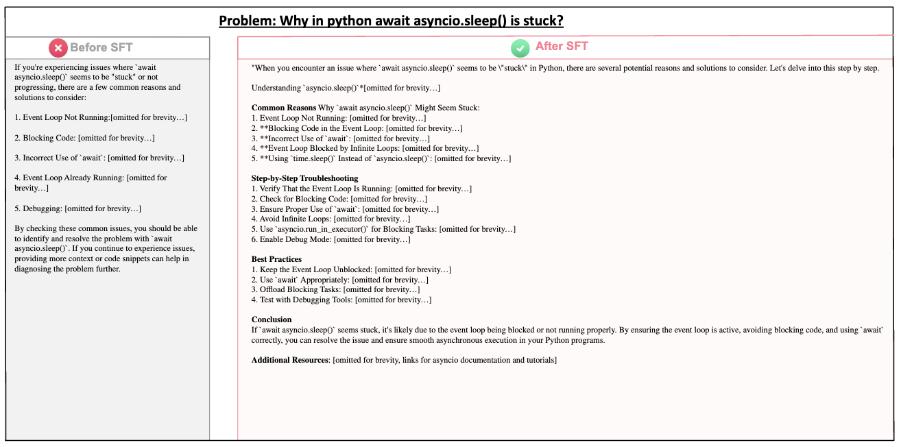

## Part2: Surpassing O1-preview through Simple Distillation (Big Progress or Bitter Lesson?)
[**Report (Part2)**](https://arxiv.org/pdf/2411.16489) | [**Citation**](#citation)


## About the Authors

[Zhen Huang](https://huangzhen02.github.io)\*, [Haoyang Zou](https://scholar.google.com/citations?user=btPmUcoAAAAJ&hl=en)\*, [Xuefeng Li](https://scholar.google.com/citations?user=DDRBbxgAAAAJ&hl=zh-CN)\*, [Yixiu Liu](https://scholar.google.com/citations?user=HKUoOq0AAAAJ&hl=zh-CN)\*, [Yuxiang Zheng](https://github.com/Zeetc)\*, [Ethan Chern](https://ethanc111.github.io/)\*, [Shijie Xia](https://shijie-xia.github.io)\*, [Yiwei Qin](https://qinyiwei.github.io), [Weizhe Yuan](https://yyy-apple.github.io/), [Pengfei Liu](https://plms.ai/)

* "*" Co-first author


## Contents

- [Introduction](#introduction)
- [Methodology](#Methodology)

- [Citation](#citation)


## Introduction

The advent of OpenAI’s O1 model has reshaped AI research, showcasing groundbreaking reasoning abilities, particularly in mathematical problem-solving. This achievement has triggered a global wave of replication efforts, many of which may rely on a less-discussed yet influential technique: distillation from O1’s API.

This report delves into the distillation of OpenAI’s O1 models, demonstrating that fine-tuning a strong foundational mathematical model with tens of thousands of O1-mini samples can surpass O1-preview’s performance on AIME with minimal technical complexity. Beyond mathematical reasoning, we explored the cross-domain performance of distilled models, uncovering both strengths and limitations, including unexpected patterns in hallucination and safety. To enhance transparency, we developed a benchmarking framework to evaluate replication efforts across dimensions like data openness and methodological clarity, introducing a ranking mechanism. Ultimately, we emphasize that while advancing AI capabilities is vital, fostering first-principles thinking among researchers is a more profound and essential mission for shaping the future of innovation.


## Methodology


**Different Methods**


These include (1) Human Thought Process Annotation, where authentic long-thought data is generated by meticulously documenting human problem-solving behaviors like reflection and backtracking; (2) Multi-Agent Systems, where collaborative interactions, such as debates between policy and critique models, naturally yield detailed reasoning chains; and (3) Distillation from Advanced Models, leveraging O1’s strong reflective capabilities to guide weaker models, though requiring precise prompting due to restricted access to O1’s internal reasoning. Each method offers unique advantages in creating robust reasoning frameworks.

**Distillation in the LLM Era:**

The use of high-quality training data has become a dominant factor in improving model performance. Distillation, extracting knowledge from advanced models like O1, has proven effective for training smaller models, as evidenced by recent works such as Alpaca and WizardLM. For reasoning tasks, combining distillation with rejection sampling enables the extraction of verifiable reasoning processes, making it a preferred approach for O1 replication due to its exceptional reasoning capabilities.

**Dataset Curation and Refinement:**

A high-quality dataset was created by selecting Olympic-level mathematical problems and filtering out unsuitable ones (e.g., those requiring images or proofs). Using reformatted technology, solutions were rewritten step-by-step with GPT-4o-mini to standardize outputs and align with the long-thought reasoning format, ensuring clarity and consistency.

**Supervised Fine-Tuning (SFT):**

The SFT process was performed in two stages:

- An initial phase to familiarize the base model (Qwen2.5-Math-72B) with the long-thought format, focusing on generating detailed and standardized step-by-step solutions.

- A second phase using a distilled dataset to further enhance reasoning quality and output coherence.

This approach illustrates the practical and scalable use of distillation for improving reasoning abilities in smaller models while maintaining high standards for data quality and output consistency.


## Evaluation

### Benchmark

We evaluated the model using well-recognized mathematical reasoning benchmarks, including MATH (MATH500 subset), AIME2024, and a curated set of problems from the 2024 China National High School Mathematics Competition (MATH2024). This diverse selection ensures a comprehensive assessment of the model’s reasoning capabilities while minimizing risks of data leakage.

### Evaluation Metric

To better capture the trade-off between computational cost and performance in modern inference-time scaling scenarios, we introduced a new metric. This approach evaluates reasoning ability under constrained test-token budgets by measuring the average token count of outputs. The method ensures evaluations reflect real-world constraints while allowing for scalable, meaningful comparisons without relying on external reward signals.


### Results


The distilled model outperformed O1-preview on AIME2024 under comparable computational costs, showcasing its capacity to replicate O1-series reasoning abilities effectively. However, the distilled model lagged behind O1-mini in terms of both accuracy and reasoning depth. This highlights areas for further optimization, particularly in refining the generated long-thought solutions for clarity and precision.

## Application Beyond Math Reasoning

In addition to reasoning tasks, we evaluated the distilled O1 model in areas such as safety, factual accuracy, and general-purpose task performance. To assess the model’s versatility, we constructed a diverse bilingual dataset, selecting 5,000 high-quality samples featuring reflective and backtracking thought processes from the distilled O1 outputs. These samples were translated into Chinese using GPT-4o mini, resulting in a balanced dataset of 10,750 bilingual sample pairs. This dataset was used for supervised fine-tuning (SFT) of the Qwen2.5-72B-Instruct model, yielding our final model.


### Safety

We created a 600-question test set using three established safety datasets: Flames, DiaSafety, and WildSafety (200 questions from each). Safety-J was used to evaluate the model’s performance pre- and post-SFT. Results showed:

- Flames: Improved from 91% to 92.5%.
- DiaSafety: Maintained 100%.
- WildSafety: Decreased from 92% to 86.5%.

This highlights a key insight: high-quality training data with reflective processes alone does not guarantee safety performance improvement unless safety alignment is explicitly incorporated.

### Hallucination

We evaluated the model’s factual accuracy using datasets like SimpleQA, ChineseSimpleQA, and ChineseFactEval. Despite improvements in reasoning depth, factual accuracy did not significantly improve post-SFT, primarily due to increased hallucinations caused by longer reasoning chains. Notably, the model occasionally simulated using search engines, fabricating results—a behavior hinting at the potential benefits of integrating real web access. Additionally, the model showed reduced susceptibility to misleading questions, thanks to its enhanced self-reflection capabilities.

### General Scenario

To assess performance in general-purpose scenarios, we curated a test set of 100 queries from Auto-J and LIMA, focusing on long-term planning tasks. Expert evaluations revealed significant improvements post-SFT:
- Auto-J: Score increased from 81.6% to 88%.
- LIMA: Score rose from 77.2% to 87.2%.

These results indicate enhanced bilingual dialogue abilities and improved performance on tasks requiring structured thinking and long-term planning.

### Cases


<details>
<summary>Case 1: how model-generated long thoughts provide alternatives, resulting in safer responses</summary>
<p align="center">        </p>
</details>


<details>
<summary>Case 2: our model attempting to actively search and leverage external tools to solve a short-form fact-seeking question</summary>
<p align="center">        </p>
</details>


<details>
<summary>Case 3: how detailed analysis and self-reflection can help prevent hallucination</summary>
<p align="center">        </p>
</details>

<details>
<summary>Case 4: how self-reflection can help models detect false assumptions</summary>
<p align="center">        </p>
</details>

<details>
<summary>Case 5: our model provides helpful insights from different perspectives on answering user questions</summary>
<p align="center">        </p>
</details>


## The Technical Transparency Index

To objectively assess O1 replication efforts, we propose the Technical Transparency Index (TTI)—a comprehensive framework designed to quantify the transparency, reproducibility, and openness of various claimed implementations. The TTI evaluates four primary dimensions, providing the research community with standardized metrics for comparing and verifying approaches.

### Evaluation Dimensions of Transparency

**Data Transparency**

Data transparency assesses whether the sources and descriptions of datasets used in the work are explicitly stated in technical reports. This includes detailing all datasets used in downstream tasks like supervised fine-tuning (SFT), reinforcement learning (RL), or search algorithms. Transparency in data is foundational for various stages, such as post-training, search algorithms, reinforcement learning, and especially for constructing long-thought (O1-like) datasets.

**Methodology Transparency**

Methodology transparency ensures that the techniques, approaches, and workflows used in the study are described with enough detail to allow replication and validation. This includes selecting and documenting foundational models, training configurations, search methods, reinforcement learning strategies, and data synthesis processes. Beyond explaining how methods are implemented, validating their effectiveness is even more crucial. Comprehensive evaluations should quantify the contributions of each technique to the overall system performance through ablation studies or comparative experiments, rather than merely reporting the final results.


**Evaluation Transparency**

Evaluation transparency emphasizes the fairness, consistency, and comprehensiveness of model assessments. It examines whether widely recognized benchmarks are used and whether they are publicly accessible. The evaluation also considers the appropriateness of metrics, ensuring their relevance to the task. When introducing custom metrics, a clear explanation of their definition and motivation is necessary. Additionally, aligning evaluation conditions across baselines is essential to ensure fair and consistent comparisons between different models and methods.


**Open-Source Resources**

Open-source resources are vital for enhancing reproducibility and enabling the research community to build upon existing work. This dimension evaluates whether datasets, trained model weights, codebases, and accompanying documentation are made publicly accessible. Releasing datasets and model weights facilitates independent verification and further research. A well-documented codebase, alongside clear supplemental materials such as technical reports or blogs, ensures that the methodology and findings are easily understood and replicated by the broader community.


### Checklist for O1-style Technique


We introduce a scoring framework to evaluate O1 replication efforts with a total of 100 points, emphasizing transparency as the cornerstone for reproducibility and openness. This system systematically assesses key dimensions outlined in Section~\ref{Evaluation Dimensions of Transparency}, providing a fair and comprehensive evaluation of each effort’s commitment to clarity and accessibility. By focusing on transparency, the framework aims to foster trust and enable meaningful progress in O1 replication research.

### Transparency Leaderboard


## The Bitter Lesson of Simple Distillation

The success of knowledge distillation from O1 provides a seemingly elegant shortcut to impressive performance gains, particularly in mathematical reasoning tasks. While it offers immediate benefits, this convenience masks deeper challenges that threaten the field’s long-term innovation and development. Prioritizing such “easy wins” risks significant setbacks in both technology and the research culture.

Distillation is not inherently problematic; it is a valuable tool in the AI research toolkit. However, its convenience should not divert the field from the more challenging, yet rewarding, pursuit of fundamental innovation. Maintaining a balance between immediate gains and long-term development is essential for advancing AI capabilities and nurturing the next generation of innovators.

**Building intelligent AI is vital, but cultivating human minds equipped with first-principles thinking is our ultimate mission—ensuring a future where innovation continues to thrive.**


## Citation

```
@article{huang2024o1,
  title={O1 Replication Journey--Part 2: Surpassing O1-preview through Simple Distillation, Big Progress or Bitter Lesson?},
  author={Huang, Zhen and Zou, Haoyang and Li, Xuefeng and Liu, Yixiu and Zheng, Yuxiang and Chern, Ethan and Xia, Shijie and Qin, Yiwei and Yuan, Weizhe and Liu, Pengfei},
  journal={arXiv preprint arXiv:2411.16489},
  year={2024}
}
```